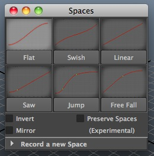

# Spaces GUI

A Maya tool that lets you manipulate the curve shape between two keys using preset shapes, or your own custom shapes.

# Installation:

Simply copy the folder into your scripts directory in Maya. The folder should be named "spacesGUI".

# Usage

Within Maya, create a shelf icon with the following PYTHON code:

	import spacesGUI
	spacesGUI.GUI()

NOTE: The checkbox "Preserve Spaces" is a great feature to help you not mess up your Spaces. While checked the tool will prevent you from selecting keys that make up the space (the green ones) so as to not mess up the shape. It will also attempt to reshape the curve shape should you move some keyframes around. Try it out in the graph editor by adding a space, selecting one of the end keys and moving it around.

* Key your object.

* Move the time slider into a spot between two keyframes.

* Select the object and choose a curve shape. If you don't like the shape, pick another one. Tick some of the checkboxes to modify the shape of the curve when created (ie: mirror places the curve shape twice, end to end).

* To make your own shape, select a bunch of keyframes in the graph editor that make up the shape. Lower the dropdown "Record a new Space" put a name in for the Space and click "Record Space".

* To delete a space, type in the name of the space you wish to delete into the "record space" area. Then press "Delete Space".